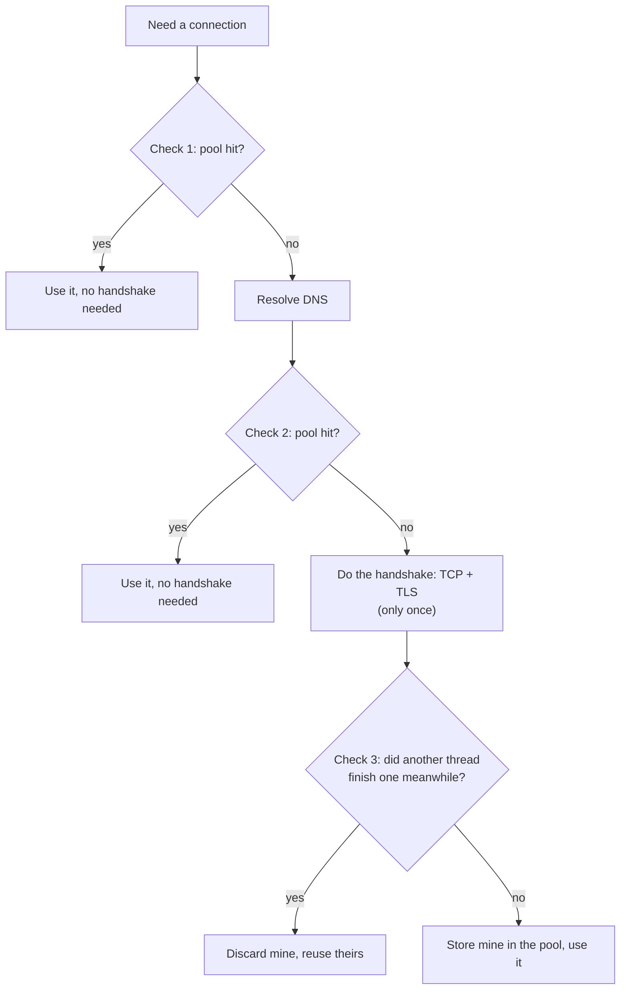
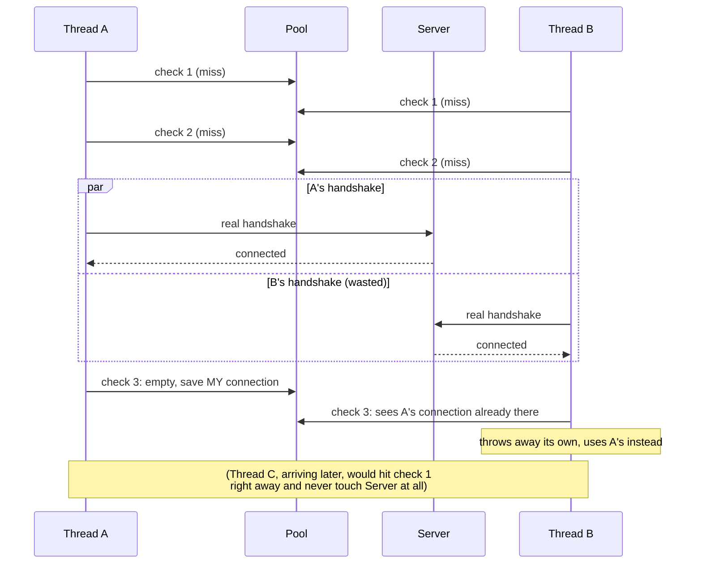
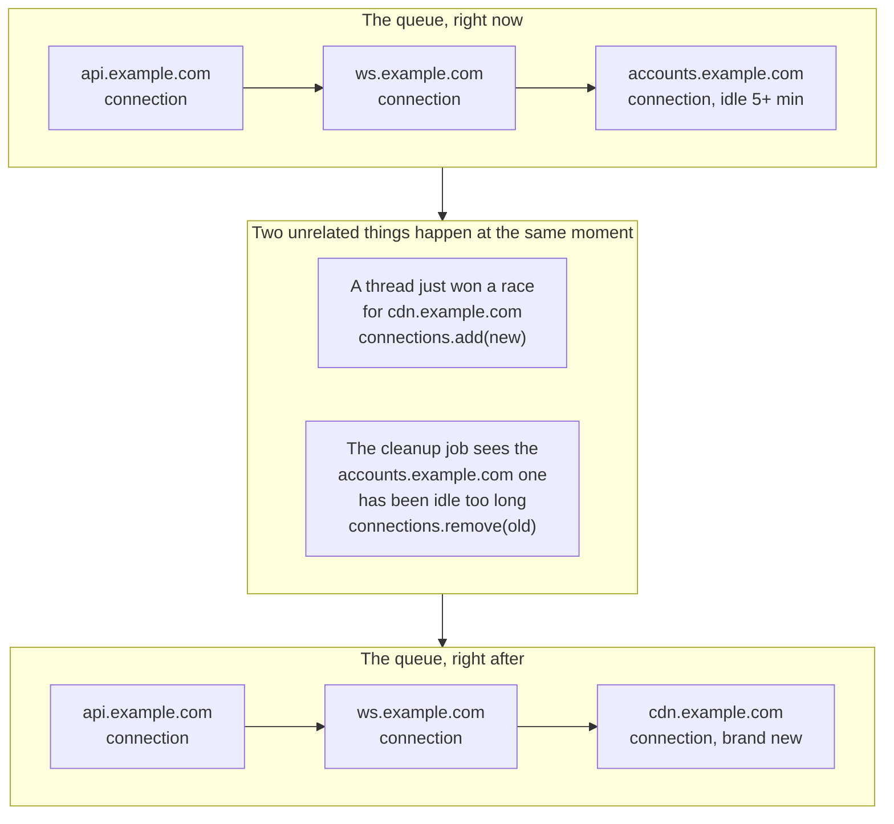

Say your app starts up and sends three requests to the same host at
almost the same time, three different pieces of data your screen needs
at once. The pool is empty, so all three need a new connection.

A new connection isn't free. It takes a DNS lookup, a TCP handshake, and
a TLS handshake, three trips over the network before any real data
moves.[^1] Reusing an old connection skips all of that. So if three
requests need a new connection at once, you really want just one, not
three. Building two extra connections wastes two full round trips for
nothing.

I looked in OkHttp's real source code, expecting to find a lock. There
isn't one.

## The naive assumption: there must be a lock somewhere

It sounds like the obvious design. Many threads share one resource, the
connection pool. That's normally a case for a lock: Thread B should wait
until Thread A either finds a connection or finishes building one.

But that's not what OkHttp does. A comment in OkHttp's own code, in
`ConnectPlan.kt`, gives it away right away:

```kotlin
// If we raced another call connecting to this host, coalesce the connections. This makes for
// 3 different lookups in the connection pool!
val pooled3 = routePlanner.planReusePooledConnection(this, routes)
if (pooled3 != null) return pooled3.connection
```

*"If we raced"* tells you something important: a race isn't just
possible here, it's expected. "Coalesce" just means this: notice a
duplicate connection exists, and use that one instead. Throw away the
extra copy. There's no lock stopping two threads from building a
connection to the same host at the same time. Both can really do it at
once: real DNS lookups, real TLS handshakes, both racing for the same
place.

## The three checks, not a lock

Every connection attempt checks the pool at **three points**, whether
it's racing another thread or running alone:



This is the real code inside `RealRoutePlanner.kt`:

```kotlin
override fun plan(): Plan {
    // Not one of the 3 checks below. A smaller, separate check:
    // does THIS SAME call already have a connection from earlier?
    // (like when it's following a redirect) If so, just use that.
    val reuseCallConnection = planReuseCallConnection()
    if (reuseCallConnection != null) return reuseCallConnection

    // CHECK 1: pool, before anything
    val pooled1 = planReusePooledConnection()
    if (pooled1 != null) return pooled1

    // (skipped here: a generic check for backup plans an outer caller
    // may have queued up, e.g. OkHttp's Fast Fallback exchange finder,
    // a separate class that races multiple IPs Happy-Eyeballs-style)

    // Do blocking DNS resolution
    val connect = planConnect()

    // CHECK 2: pool again, now we know the route
    val pooled2 = planReusePooledConnection(connect, connect.routes)
    if (pooled2 != null) return pooled2

    return connect   // goes on to do the handshake
}
```

Check 3 lives in a different file, `ConnectPlan.kt`, right after a
handshake finishes. It's the code from the start of this post.

## Watching the race play out

Three threads, same host, nothing in the pool yet:

```
Thread A (first to arrive)
  check 1: miss
  check 2: miss
  does a real handshake
  check 3: pool still empty, keeps its own connection, saves it

Thread B (racing with A, a moment later)
  check 1: miss (A isn't done yet)
  check 2: miss
  does its OWN real handshake too, at the same time as A, wasted
    work, but it happens anyway
  check 3: A's connection is already in the pool, and it's HTTP/2
    (which can handle many requests on one connection)
  throws away its own connection, uses A's instead

Thread C (arrives after A is done)
  check 1: HIT, A's connection is already there
  uses it right away. Never does a handshake at all.
```



Only Thread B did work that turned out useless, and that only happened
because it started at almost the same moment as Thread A. Everyone else
either goes first, or arrives late enough to find the answer already
there.

Thread C is the clean case: it shows up after the race is already
settled. But a fourth or fifth thread could just as easily have started
in that same narrow window, before check 3 ever cleared the pool, and
each of those would waste a handshake too. The wasted work scales with
how many requests land in that gap, it isn't capped at exactly one.

## The tradeoff behind this design

A lock gives you certainty, but it costs something on *every single
request*. Thread B would sit there doing nothing, waiting for Thread A,
every time, whether a real race was happening or not.

OkHttp pays a different price. Pool checks are cheap and happen all the
time. Checkpoint 1 alone handles the common case: the connection is
already there, done. Two real handshakes racing each other is rare. It
only happens when two requests start within microseconds of each other.
Even then, checkpoint 3 is the fix. It cleans up right away and throws
away the loser.

The same idea goes even deeper than the checks above. The pool's own
storage, where these connections actually sit, isn't a plain list behind
a lock. It's a
[`ConcurrentLinkedQueue`](https://github.com/square/okhttp/blob/master/okhttp/src/commonJvmAndroid/kotlin/okhttp3/internal/connection/RealConnectionPool.kt).

A `ConcurrentLinkedQueue` lets many threads read and write at once, with
no shared lock. It uses small atomic steps instead of one big gate. A
thread scanning it can sometimes see a connection that another thread
just removed, a stale look, not a perfect one. That's fine, for the same
reason the race is fine. Code that takes a connection out of the pool
always checks if it's still healthy first, so a stale read just gets
caught and thrown out a moment later.

One thing worth fixing here: it's easy to assume this is what protects
the exact race above. It isn't, not quite. In that race, only the
*winning* thread ever calls `connections.add()`. The losing thread's
connection never reaches the pool at all. `handleSuccess()` checks for a
match *before* calling `put()`. A match means an early exit, so `put()`
never runs for the loser. Thread A and Thread B aren't really racing
each other at the queue itself.

Where the queue's protection actually matters: this is **one shared
queue for the whole `OkHttpClient`**. It covers every host the app talks
to, plus a background job that clears out old connections on its own
schedule. So even though A and B aren't racing each other at the queue,
a different thread winning its own race for a *different* host can call
`.add()` at the very same moment. A cleanup job can also be removing an
old connection at that same moment:



(Note: this "one connection per host" pattern is specific to HTTP/2
hosts, since one HTTP/2 connection already serves unlimited requests.
An HTTP/1.1 host can and does keep several pooled connections at once,
since each one only serves a single request at a time, that's the
whole reason `maxIdleConnections` exists. The three entries above are
three *different* hosts on purpose, not three connections to the same
one.)

OkHttp's own comment on this field says so directly:

```kotlin
/**
 * Holding the lock of the connection being added or removed when mutating this, and check its
 * [RealConnection.noNewExchanges] property. This defends against races where a connection is
 * simultaneously adopted and removed.
 */
private val connections = ConcurrentLinkedQueue<RealConnection>()
```

The real reason isn't the one race in this story. It's that one queue
serves the whole app, all the time, across every host and every cleanup
pass.

Worth remembering next time you're reading someone else's code: a
comment like *"if we raced..."* usually means the same thing here. The
author saw the race coming and decided cleanup was cheaper than a lock.

## References

- [`RealRoutePlanner.kt`](https://github.com/square/okhttp/blob/master/okhttp/src/commonJvmAndroid/kotlin/okhttp3/internal/connection/RealRoutePlanner.kt), [`ConnectPlan.kt`](https://github.com/square/okhttp/blob/master/okhttp/src/commonJvmAndroid/kotlin/okhttp3/internal/connection/ConnectPlan.kt), and [`RealConnectionPool.kt`](https://github.com/square/okhttp/blob/master/okhttp/src/commonJvmAndroid/kotlin/okhttp3/internal/connection/RealConnectionPool.kt) from [square/okhttp](https://github.com/square/okhttp), read directly rather than assumed.

[^1]: This is true for OkHttp specifically. It only ever speaks HTTP/1.1
    or HTTP/2, both built on TCP. OkHttp has no built-in HTTP/3
    (QUIC/UDP) support at all. Getting HTTP/3 with it means swapping in
    Google's separate [Cronet](https://github.com/google/cronet-transport-for-okhttp)
    transport instead, a different path from everything in this post.
    That's confirmed straight from that library's own docs: *"the
    entirety of OkHttp core is bypassed. This includes caching, retries,
    authentication, and network interceptors."* The race and the cleanup
    story above are part of exactly the code that gets skipped. If
    OkHttp did support QUIC on its own, the handshake picture would look
    different too. QUIC folds transport and TLS into one round trip
    instead of two.
