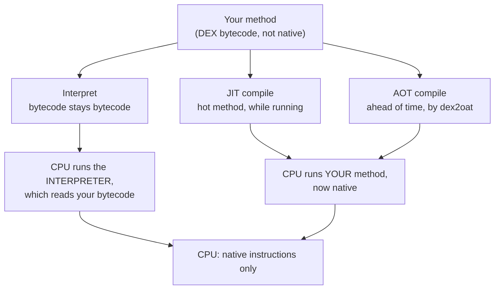

Install an app from the Play Store, tap its icon, and it opens and works
right away the first time, with no "compiling..." step you ever see. So by
the time you tap it, it must already be compiled to native machine code.
That was my assumption, and the reasoning felt airtight: the CPU only runs
native instructions, the app clearly runs, so someone must have compiled it.

I checked with `adb`, which can read an app's compilation status. One second
after installing, here's what it showed:

```
$ adb shell dumpsys package <package> | grep status=
  arm64: [status=verify] [reason=install]
```

So `verify` means Android checked the bytecode and confirmed it's valid, but
compiled none of it to native. The app is running by interpreting that
bytecode, and it works fine anyway.

## The naive assumption: running means compiled

It sounds obvious. A CPU runs only native machine instructions, and your app
is DEX bytecode, which isn't native. So for the app to run, that bytecode has
to become native code first. The first half of that is right: the CPU really
does only run native instructions. The second half is where it falls apart,
because your code doesn't have to be the native code the CPU runs.

The missing piece is the interpreter, part of ART, the Android Runtime. The
interpreter is itself native code, and its job is to read your bytecode one
instruction at a time and do what each instruction says, so your code stays
bytecode the whole time while the interpreter does the CPU work for it. Think
of it like a book in a language you can't read: a translator sits next to you
and reads it aloud, line by line, never rewriting the book, doing the work
live. That's the interpreter, and it's why "the app runs" doesn't have to
mean "the app is native." It can mean "a native interpreter is reading the
app's bytecode," which is exactly what `verify` is: the code is checked but
not compiled, and the interpreter runs it.

## Three ways the same code reaches the CPU

Once you accept that compiling to native is optional, the picture opens up.
There are three routes from your bytecode to the CPU, and an app uses all
three of them at once.



The trick is in the bottom row. Every route ends at the CPU as native code,
and the only difference is whose native code it is. When interpreting, the
native code the CPU runs is the interpreter, not your method, while with JIT
or AOT it's your own method, compiled.

- **Interpret** is the translator reading aloud. No prep, works immediately,
  slower every time.
- **JIT** (Just-In-Time) is ART noticing a method runs a lot and compiling
  that method to native while the app runs. Fast after that, but the warm-up
  repeats on every cold start.
- **AOT** (Ahead-Of-Time) is a tool called `dex2oat` compiling methods to
  native in advance. They're already native before the app starts.

JIT and AOT both print a translated copy of the book. Someone translates
once, and after that you read it directly.

## Watching the modes switch live, on a real app

This part was easier than I expected. You can force an installed app between
these modes yourself and watch the state change. It works on any installed
app, no root, including ones from the Play Store. So instead of a toy, I
used a big real one already on my phone: LinkedIn.

The tool is `cmd package compile`. The `-m` flag picks the mode, `-f` forces
a recompile, and `dumpsys package` reads back the current one.

```
$ adb shell cmd package compile -m verify -f com.linkedin.android
Success
  arm64: [status=verify]        ← interpret + JIT only, no native

$ adb shell cmd package compile -m speed -f com.linkedin.android
Success
  arm64: [status=speed]         ← full AOT, everything native
```

`verify` leaves the app to interpret and JIT at runtime, with no native
code. `speed` means `dex2oat` compiled every method to native up front. Same
app, two answers to "how does this run," switchable in a second.

I wanted to see the native code itself, not just a label. `dex2oat` writes
it to an `.odex` file whose path is hashed, so you pull the path from
`dumpsys` first and then `stat` it, which works on an unrooted phone even
though listing the directory doesn't. Here's the whole thing, forcing each
mode and measuring the file:

```
# grab the (hashed) .odex path once
$ odex=$(adb shell dumpsys package com.linkedin.android \
    | grep -m1 'location is' | grep -o '/data/[^]]*\.odex')

$ adb shell cmd package compile -m verify -f com.linkedin.android
$ adb shell stat -c %s "$odex"
590592           # 0.56 MB, verification metadata, ~no native code

$ adb shell cmd package compile -m speed -f com.linkedin.android
$ adb shell stat -c %s "$odex"
217823560        # 208 MB, every method compiled to native
```

That's not a typo. Compiling one real app fully produced **208 MB** of
native machine code, 369 times the size of the verify-only file. It's not a
metaphor or a diagram box, but a real file on disk that exists when you
compile and vanishes when you don't.

That number is also why no app ships this way. LinkedIn's real state on my
phone was neither extreme. The mode that actually ships is the middle one,
`speed-profile`, which compiles only the methods a profile marks as hot:

```
$ adb shell cmd package compile -m speed-profile -f com.linkedin.android
$ adb shell stat -c %s "$odex"
53893752         # 51 MB, about a quarter the size of full speed
```

Multiply 208 MB by every app on a phone and you'd fill the disk with
compiled code, so `speed-profile` is the compromise that ships. It's also
LinkedIn's normal state, so running that last command just reset the app to
where it started.

## Three things the device taught me that no article did

This is where running it paid off. Three results surprised me, and each one
turned out to be correct behavior rather than a glitch.

**One: a debug build refuses to AOT-compile.** My first attempt used a debug
build. I ran `-m speed`, the command said `Success`, and the status stayed
at `verify`. It looked broken. It isn't. ART keeps debuggable apps
interpretable on purpose, so a debugger can attach and step through them.
You can't fully AOT-compile a debug build. I had to sign a release build
before `-m speed` produced `speed`.

**Two: profile-guided compilation does nothing on a fresh app.** There's a
third mode, `speed-profile`, and it's the default Android uses. It compiles
only the methods a profile marks as hot, not everything. I ran it on a
freshly installed app and the status stayed at `verify`. Nothing compiled,
and the reason is simple: a profile records which methods ran hot in real
use, and an app that has never run has no profile, so `speed-profile` has
nothing to compile. This is the gap Baseline Profiles fill. They ship a
ready-made profile inside the APK, so `speed-profile` has something to work
with from the first launch instead of after several.

**Three: fresh installs really do compile nothing to native.** That opening
`verify` status wasn't a fluke, it's the default. Since Android 7, apps
install with no AOT compilation at all, so install just verifies the
bytecode, and the app then interprets, JITs the hot spots, and quietly
records a profile while you use it. Later, when the phone is idle and
charging, `dex2oat` runs on its own and compiles the hot methods, so the
next launch is faster because of work done while you weren't looking. (A debug build gets even less. It
installs at `run-from-apk`, not even verified, because the OS leaves it
untouched so a debugger can attach.)

## Why Google gave up compiling everything at install

It didn't always work this way. On Android 5 and 6, `dex2oat` compiled the
entire app to native at install time, every method, up front. That made apps
run fast, but it had two costs that got worse as apps grew. Installs and
system updates were slow, because every app had to be fully recompiled
before you could use it, and the compiled output ate storage, because you
paid to compile code that many users would never run.

Android 7 traded that for the hybrid model above: install compiles nothing,
JIT handles the warm-up, and AOT later compiles only what a profile proves
is hot. You give up peak speed on the first few launches, but you get fast
installs, less wasted storage, and compilation spent only on the code that's
really used.

That tradeoff is why your app runs interpreted the moment it installs, and
why it isn't native when you first tap it. It's not an oversight. The
interpreter carrying a fresh install is the design working as intended.

## Worth remembering

Next time you're sure some code must be compiled because it clearly runs,
check. Running and native aren't the same claim. An interpreter is native
code that runs your bytecode without ever compiling it. A lot of your app
spends its early life right there.

And when a concept has a runtime you can poke at, poke at it. Two `adb`
commands turned "there are three execution modes" from a sentence I'd read
into three results I'd watched happen. The diagram was right. Running it was
what made me believe it.

---

*All the status lines and sizes came from running these commands on a real,
unrooted phone (`arm64`), not from documentation. `stat` reads an app's
`.odex` straight off the device even without root, though listing the
directory is blocked. `adb shell cmd package compile -m <mode> -f <pkg>`
forces a mode. `adb shell dumpsys package <pkg>` reads the current one. The
`verify`, `speed-profile`, and `speed` modes, and the Android 5/6 to 7 to 14
history, are documented at
[developer.android.com](https://developer.android.com/topic/performance/baselineprofiles/overview)
and [source.android.com](https://source.android.com/docs/core/runtime/configure).
The numbers came from watching, not reading.*
